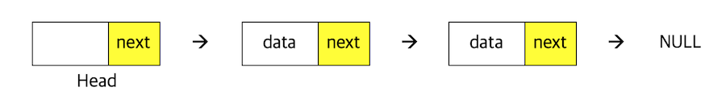

## Metadata
- 강의명: C/C++/자료구조
- 주제명: 20강 - 연결 리스트
- 날짜: 2020. 2. 4.

## Index
- 연결 리스트의 필요성과 그 쓰임새에 대하여 학습
- C 언어로 연결 리스트 구현

## 연결 리스트의 필요성
- 일반적으로 배열을 사용하여 데이터를 순차적으로 저장한다
- 이때, 배열을 사용하면 메모리 공간이 불필요하게 낭비될 수 있다

> TL;DR - 연결 리스트에서 필요한 것
> 1. 연결 리스트 노드의 타입
> 2. 연결 리스트의 구성 요소: head
> 3. 순회, 삽입, 삭제, 검색, 메모리 해제 함수

### 배열 기반의 리스트

    ```cpp
    #include <stdio.h>
    #define INF 10000 // 아주 큰 메모리 공간을 가정

    int arr[INF];
    int count = 0;

    void addBack(int data) {
      arr[count] = data;
      count++;
    }

    void addFirst(int data) {
      for (int i = count ; i >= 1; i--) {
        arr[i] = arr[i-1];
      }
      arr[0] = data;
      count++;
    }

    void show() {
      for (int i = 0 ; i < count ; i++) printf("%d ", arr[i]);
    }

    int main(void) {      
      addBack(7);
      addBack(6);
      addBack(8);
      addFirst(4);
      addFirst(5);
      addFirst(1);
      show();

      return 0;
    }
    ```

앞부분 삽입시: 한 칸씩 뒤로 당겨주어야 함

### 그러면, 특정 위치의 원소를 삭제하려면...?
    ```cpp
    void removeAt(int index) {
      for (int i = index ; i < count - 1 ; i++) arr[i] = arr[i + 1];
      count--;
    }
    ```

## 배열 기반 리스트의 특징
- 배열로 만들어졌으므로, 특정 위치의 요소에 즉시 접근 가능 (O(1))
- 단점: 데이터가 저장될 공간을 미리 메모리에 할당해두어야 함
- 특정 위치로의 삽입/삭제가 비효율적
  - 삽입/삭제 시간이 O(n)

## 연결 리스트
- 구조체와 포인터를 함께 사용하여 구현하는 것이 일반적
- 리스트의 중간 지점에 노드를 추가/삭제할 수 있어야 함
  - O(1)
- 필요할 때마다 메모리 공간을 할당받는다

## 단일 연결 리스트의 구현
- 포인터를 사용하여 단방향적으로 다음 노드를 가리킨다
- HEAD: 연결 리스트의 시작 노드를 가리키며, 별도로 관리
- 끝 노드의 다음 위치값으로는 NULL을 사용



```cpp
#include <stdio.h>
#include <stdlib.h>

typedef struct {
  int data;
  struct Node* next;
} Node;

Node* head;

int main(void) {
  head = (Node*) malloc(sizeof(Node));

  Node* node1 = (Node*) malloc(sizeof(Node));
  node1->data = 1;

  Node* node2 = (Node*) malloc(sizeof(Node));
  node2->data = 2;
  
  head->next = node1;
  node1->next = node2;
  node2->next = NULL;

  Node* cursor = head->next;

  while (cur != NULL) {
    printf("%d ", cursor->data);
    cursor = cursor->next;
  }

  return 0;
}
```

## 연결 리스트의 삽입

1. 새로 삽입할 노드를 선언
2. 새로운 노드를 삽입할 위치를 검색
3. 삽입할 위치에 존재하는 노드 뒤의 노드를 새로운 노드가 가리키도록 조작
4. 삽입할 위치 앞에 존재하는 노드가 새로운 노드를 가리키도록 조작

```cpp
void addFront(Node* root, int data) {
  // root 노드 뒤에 새로운 노드를 생성하고 연결
  Node* node = (Node*) malloc(sizeof(Node));
  node->data = data;
  node->next = root->next;
  root->next = node;
}
```

## 연결 리스트의 삭제

1. 삭제할 노드의 앞에 존재하는 노드가 삭제할 노드의 뒤에 존재하는 노드를 가리키도록 조작
2. 삭제할 노드를 메모리 해제

```cpp
void removeFront(Node* root) {
  // root 노드 뒤의 front 노드를 연결 리스트 내에서 삭제
  Node* front = root->next;
  root->next = front->next;
  freeNode(front);
}
```

## 연결 리스트의 메모리 해제
```cpp
// 첫번째 원소부터 끝까지 모든 노드 해제
// head 노드는 건드리지 않았다
void freeList() {
  Node* cur = head->next;
  while (cur != NULL) {
    Node* next = cur->next;
    freeNode(cur);
    cur = next;
  }
}
```

## 연결 리스트 순회 함수
```cpp
void showList() {
  Node* cur = head->next;
  while (cur != NULL) {
    Node* next = cur->next;
    printf("%d ", cur->data);
    cur = cur->next;
  }
}
```

## 연결 리스트의 활용
```cpp
int main(void) {
  head = (Node*) malloc(sizeof(Node));
  head->next = NULL; // 연결 리스트의 초기화; 빈 리스트

  addFront(head, 2);
  addFront(head, 5);
  addFront(head, 1);
  removeFront(head);
  showList();
  freeList();
}
```

## 연결 리스트 구현시 주의
예외 처리를 잘 해주어야 한다!

- 제거할 원소가 존재하지 않는 경우, Head 노드가 틀린 경우 등의 검사

## 연결 리스트의 특징
- 배열에 비하여 **삽입, 삭제**가 간단하다
- 특정 인덱스를 통한 요소 접근이 불가능하며, **순차 접근**만이 가능
- 포인터 변수가 추가적으로 사용되어 메모리가 낭비된다
