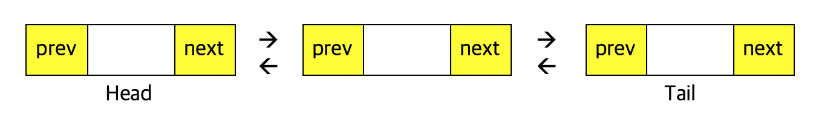

## Metadata
- 강의명: C/C++/자료구조
- 주제명: 21강 - 양방향 연결 리스트
- 날짜: 2020. 2. 4.

## Index
- 양방향 연결 리스트의 동작 원리와 구현 방법 학습
- 양방향 연결 리스트를 구현하며 포인터 구현 능력 향상

## 양방향 연결 리스트
- Head와 Tail을 모두 가지는 연결 리스트
- 각 노드는 **앞 노드**와 **뒤 노드**의 정보를 모두 저장
- 양방향 연결 리스트는 앞과 뒤 모두에서 접근 가능하다



```cpp
#include <stdio.h>
#include <stdlib.h>

typedef struct {
  int data;
  struct Node* prev;
  struct Node* next;
} Node;

Node *head, *tail;
```

> 여기서 구현하는 연결 리스트는 **오름차순**으로 데이터가 저장된다.

## 양방향 연결 리스트의 삽입
1. 새로 삽입할 노드를 선언
2. 새로운 노드를 삽입할 위치를 검색
3-1. 삽입할 위치 앞에 존재하는 노드의 `next`가 새로운 노드를 가리키도록 조작
3-2. 새로운 노드의 `prev`가 삽입할 위치 앞에 존재하는 노드를 가리키도록 조작
4-1. 삽입할 위치 뒤에 존재하는 노드의 `prev`가 새로운 노드를 가리키도록 조작
4-2. 새로운 노드의 `next`가 삽입할 위치 뒤에 존재하는 노드를 가리키도록 조작

```cpp
void insert(int data) {
  Node* node = (Node*) malloc(sizeof(Node));
  node->data = data;

  Node* cur = head->next;
  while (cur->data < data && cur != tail) {
    cur = cur->next;
  } // cur: 삽입할 새 노드의 뒤 노드

  Node* prev = cur->prev;
  // prev <-> node <-> cur
  prev->next = node;
  node->prev = prev;
  cur->prev = node;
  node->next = cur;
}
```

## 양방향 연결 리스트의 삭제
1. 삭제할 노드의 앞에 존재하는 노드의 `next`가 삭제할 노드의 뒤에 존재하는 노드를 가리키도록 조작
2. 삭제할 노드의 뒤에 존재하는 노드의 `prev`가 삭제할 노드의 앞에 존재하는 노드를 가리키도록 조작
3. 삭제할 노드를 메모리 해제

```cpp
void removeFront() {
  // 맨 처음 노드 제거
  Node* node = head->next;
  head->next = node->next;
  Node* next = node->next;
  next->prev = head;
  freeNode(node);
}
```

## 양방향 연결 리스트의 순회 함수
```cpp
void showList() {
  Node* cur = head->next;
  while (cur != tail) {
    printf("%d ", cur->data);
    cur = cur->next;
  }
}
```

## 양방향 연결 리스트의 활용
```cpp
int main(void) {
  head = (Node*) malloc(sizeof(Node));
  tail = (Node*) malloc(sizeof(Node));

  head->next = tail;
  head->prev = head;
  tail->prev = head;
  tail->next = tail;

  insert(2);
  insert(5);
  insert(1);
  removeFront();
  showList();

  return 0;
}
```

## 양방향 연결 리스트 구현에 있어 주의할 점
예외 처리를 잘 해주어야 한다!

- 제거할 원소가 존재하지 않는 경우, Head, Tail 노드가 틀린 경우 등의 검사
