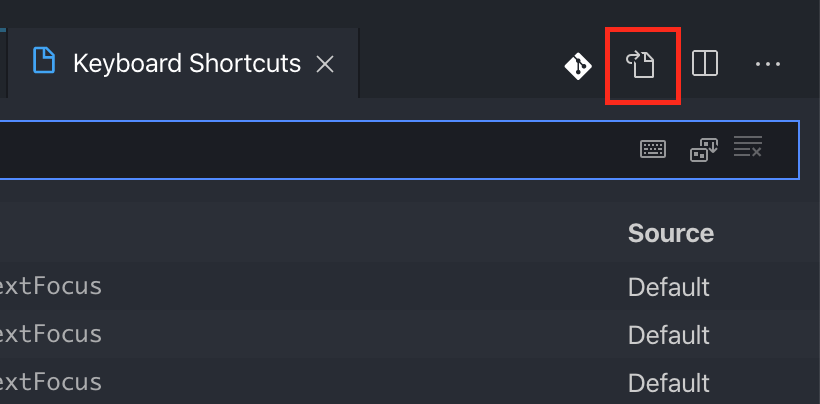

# Visual Studio Code에서 C++ 코드 컴파일 및 실행하기

## How to Run Commands
컴파일 및 실행하고자 하는 소스 코드의 파일을 연 상태에서 아래의 단축키 명령을 실행한다.

- 컴파일 및 빌드: `Ctrl + Alt + C`
- 실행: `Ctrl + Alt + E`

컴파일 완료된 실행 파일은 소스 코드 파일이 존재한 디렉토리에 생성된다.

## Prerequisite
- VS Code 설치
- gcc, gpp 등 C/C++ 컴파일러 설치
- C/C++ VS Code 확장 플러그인 설치

## Procedure

1. 작성한 C/C++ 코드가 실행될 VS Code 워크스페이스를 선정하여 좌측 Explorer에 설정한다.

2. `Command(Windows는 Ctrl) + Shift + P`를 누르고, `C/C++: Edit Configurations (UI)` 입력하고 `Enter`를 누른다.

3-1. 워크스페이스 루트 디렉토리 상에 `.vscode`라는 디렉토리가 자동으로 생성된다. 지금부터 설정하는 파일들이 해당 디렉토리 내에 자동으로 저장되어 관리된다. 

  > `.vscode` 디렉토리가 현재 워크스페이스에 생성되지 않는 경우가 있다. 이 때는 현재 작업 중인 워크스페이스를 Explorer 상에서 맨 위로 옮겨주면 된다.
  > 현재의 워크스페이스를 기준으로 형성되는 여러 서브 디렉토리에 대하여 컴파일 및 실행 커맨드가 작동하려면 이 설정들이 반드시 필요하다

3-2. [컴파일러 경로] 옵션에서 컴파일에 사용할 컴파일러를 선택한다.

  > 컴파일러를 탐지하느라 바로 목록이 나오지 않을 수 있다. 조금만 기다리면 된다.

3-3. [IntelliSense 모드] 옵션에서 `gcc-x64`를 선택한다.

3-4. 설정을 옵션을 선택할 때마다 반영되어 자동으로 저장된다. 설정이 끝났으면 해당 탭을 닫는다.

4-1. 이제 컴파일 및 실행시 수행할 작업을 정의한다. 상단 메뉴에서 [Terminal > Configure Tasks...]를 선택하고, 최하단의 [Create tasks.json file from template] 옵션을 선택한다.

  > 만약 해당 옵션이 없다면, [Terminal > Create Default Build Task...]를 선택하고 해당 이름의 옵션이 존재하는지 찾아본다.

4-2. [Others] 옵션을 선택한다. 그러면 `.vscode` 디렉토리에 `tasks.json` 파일이 새롭게 생성된다.

4-3. 본래 존재하던 내용을 모두 제거하고, 아래의 내용으로 대체한다.
```json
{
    "version": "2.0.0",
    "runner": "terminal",
    "type": "shell",
    "echoCommand": true,
    "presentation" : { "reveal": "always" },
    "tasks": [
          //C++ 컴파일
          {
            "label": "save and compile for C++",
            "command": "g++",
            "args": [
                "${file}",
                "-o",
                "${fileDirname}/${fileBasenameNoExtension}"
            ],
            "group": "build",

            //컴파일시 에러를 편집기에 반영
            //참고:   https://code.visualstudio.com/docs/editor/tasks#_defining-a-problem-matcher

            "problemMatcher": {
                "fileLocation": [
                    "relative",
                    "${workspaceRoot}"
                ],
                "pattern": {
                    // The regular expression. 
                   //Example to match: helloWorld.c:5:3: warning: implicit declaration of function 'prinft'
                    "regexp": "^(.*):(\\d+):(\\d+):\\s+(warning error):\\s+(.*)$",
                    "file": 1,
                    "line": 2,
                    "column": 3,
                    "severity": 4,
                    "message": 5
                }
            }
        },
        //C 컴파일
        {
            "label": "save and compile for C",
            "command": "gcc",
            "args": [
                "${file}",
                "-o",
                "${fileDirname}/${fileBasenameNoExtension}"
            ],
            "group": "build",

            //컴파일시 에러를 편집기에 반영
            //참고:   https://code.visualstudio.com/docs/editor/tasks#_defining-a-problem-matcher

            "problemMatcher": {
                "fileLocation": [
                    "relative",
                    "${workspaceRoot}"
                ],
                "pattern": {
                    // The regular expression. 
                   //Example to match: helloWorld.c:5:3: warning: implicit declaration of function 'prinft'
                    "regexp": "^(.*):(\\d+):(\\d+):\\s+(warning error):\\s+(.*)$",
                    "file": 1,
                    "line": 2,
                    "column": 3,
                    "severity": 4,
                    "message": 5
                }
            }
        },
        // 바이너리 실행(Ubuntu)
        {
            "label": "execute",
            "command": "cd ${fileDirname} && ./${fileBasenameNoExtension}",
            "group": "test"
        }
        // 바이너리 실행(Windows)
        // {
        //     "label": "execute",
        //     "command": "cmd",
        //     "group": "test",
        //     "args": [
        //         "/C", "${fileDirname}\\${fileBasenameNoExtension}"
        //     ]
        // }
    ]
}
```

  > 코드에 적혀있듯, 실행 환경에 따라 주석 처리된 코드를 선택하여 활용하면 된다.

5-1. 이제 컴파일 및 실행을 편하게 수행할 수 있도록 단축키를 설정한다. 상단 메뉴에서 [Code > Preferences > Keyboard Shortcuts]를 선택한다.

  > VS Code의 버전 혹은 실행 환경에 따라 경로가 바뀌었을 수도 있다. 알아서 찾자.

5-2. 기본값으로 설정된 단축키 바인딩 목록이 표시된다. 여기에 없는 새로운 단축키 설정을 직접 추가해야 한다. 파일 탭 오른쪽에 있는 아이콘 중 `Open Keyboards Shortcuts (JSON)`에 해당하는 아이콘을 클릭한다.
     

5-3. `keybindings.json` 파일이 열린다. 아래의 내용을 추가한다.

```json
[
    //컴파일
    { "key": "ctrl+alt+c", "command": "workbench.action.tasks.build" },
    
    //실행
    { "key": "ctrl+alt+r", "command": "workbench.action.tasks.test" }
]
```

## Reference
- https://webnautes.tistory.com/1158
